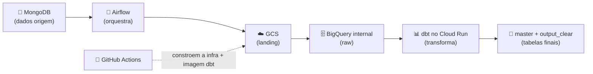
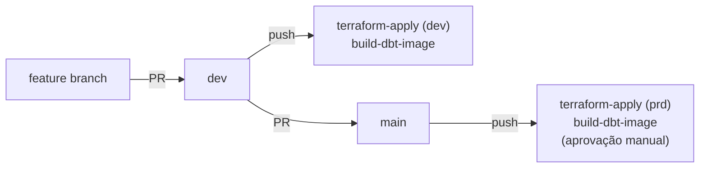

# 🎵 COMEÇAR AQUI — Guia completo para replicar o projeto

> 🌐 **Idiomas:** **🇧🇷 Português (BR) (este arquivo)** · [🇬🇧 English](START_HERE.md)

Este guia leva **qualquer pessoa**, do zero até ter o pipeline funcionando.
Siga os passos em ordem, de cima para baixo. Cada passo diz **o que fazer**,
**por quê** e **o comando exato**.

Há dois caminhos. Faça o **A** primeiro (é grátis e prova que tudo funciona);
faça o **B** só quando quiser rodar na Google Cloud de verdade.

| Caminho | Onde roda | Custo | Para quê |
| ------- | --------- | ----- | -------- |
| 🟢 **A — Local** | no seu PC (Docker) | grátis | aprender, demonstrar, portfólio |
| 🔵 **B — GCP real** | Google Cloud | pode cobrar | ambiente dev/prd de verdade |

---

## 🧩 O que faz o projeto (em 30 segundos)

Um **data product** que puxa dados de um app de música do **MongoDB**, leva eles
para a **Google Cloud**, e transforma em tabelas limpas no **BigQuery** com
o **dbt**, orquestrado pelo **Airflow** e automatizado por **GitHub Actions**.



**Camadas BigQuery:** `internal` (raw bruto) → `master` (`t_raw_*`, tratado) →
`output_clear` (`v_raw_*`, views de consumo) → `monitoring` (frescor).

---

## 🗂️ Estrutura do repositório (mapa)

```
FINAL_PROJECT/
├─ docker-compose.yml          # MongoDB + mongo-express (local)
├─ seed/                       # gera dados falsos no MongoDB
├─ app/astro/                  # projeto Airflow (Astro CLI)
│  ├─ dags/                    # o DAG do ETL
│  ├─ music_stream_rawdp/      # config (base.py) e operadores
│  └─ .env.example             # variáveis de ambiente locais
├─ transformations/dbt/        # modelos dbt (master, output_clear, ...)
├─ infrastructure/             # Terraform (bootstrap + resources)
│  └─ projects/
│     ├─ bootstrap/            # projeto GCP + SAs + WIF + state bucket
│     └─ resources/            # buckets, datasets, Cloud Run, ...
├─ .github/workflows/          # CI/CD (ci, terraform, build-dbt-image, ...)
├─ scripts/                    # set_github_secrets.ps1 / .sh
├─ tests/                      # pytest
├─ SETUP.md                    # versão técnica detalhada do Caminho B
└─ START_HERE.md               # versão em inglês deste guia
```

---

# 🟢 CAMINHO A — Rodar no seu computador

### Passo 0 — Instalar os programas (uma vez)

| Programa | Para quê | Link |
| -------- | -------- | ---- |
| 🐳 **Docker Desktop** | roda MongoDB e Airflow | https://www.docker.com/products/docker-desktop |
| 🐍 **Python 3.10+** | linguagem do projeto | https://www.python.org/downloads |
| 🚀 **Astro CLI** | motor do Airflow local | https://www.astronomer.io/docs/astro/cli/install-cli |

> Abra o **Docker Desktop** e espere ficar verde ("Engine running"). Sem isso
> nada funciona.

**Verifique se está tudo instalado:**

```powershell
docker --version
python --version
astro version
```

---

### Passo 1 — Clonar o projeto

```powershell
git clone https://github.com/<seu-usuario>/music-stream-rawdp.git
cd music-stream-rawdp
```

---

### Passo 2 — Subir o MongoDB (dados de origem)

```powershell
docker compose up -d
```

Sobe o MongoDB e o **mongo-express** (interface visual) em
http://localhost:8081. 

**Verifique:** `docker compose ps` deve mostrar os contêineres `Up`.

---

### Passo 3 — Popular o MongoDB com dados falsos

```powershell
pip install -r seed/requirements.txt
python seed/generate_seed_data.py
```

Cria gêneros, artistas, músicas e reproduções. Confirme no mongo-express
(http://localhost:8081) que existem coleções no banco `music_streaming`.

---

### Passo 4 — Configurar o ambiente do Airflow

```powershell
cd app/astro
Copy-Item .env.example .env
```

Abra o `.env` e confirme (para o Caminho A local, os valores padrão servem):

- `DEPLOY_ENV=dev`
- `MONGO_URI=...host.docker.internal...` (o Airflow no Docker chega ao Mongo
  do seu PC por `host.docker.internal`).

> ℹ️ Para o **Caminho A** você não precisa de GCP. Se quiser que os passos que
> escrevem em GCS/BigQuery funcionem, siga o Caminho B primeiro e use as
> credenciais GCP (ver Passo B7).

---

### Passo 5 — Subir o Airflow

```powershell
astro dev start
```

Quando terminar, abra 👉 **http://localhost:8080** (usuário `admin`,
senha `admin`).

Ative o DAG `music-stream-rawdp-etl` e clique em ▶️ para dispará-lo.

**Comandos úteis:**

```powershell
astro dev restart   # aplica mudanças no .env / config (relê na inicialização)
astro dev stop      # desliga o Airflow
astro dev logs      # ver logs
```

---

### Passo 6 — Desligar tudo no fim

```powershell
astro dev stop
cd ../..
docker compose down
```

✅ **Você concluiu o Caminho A.**

---

# 🔵 CAMINHO B — Rodar na Google Cloud (dev e prd)

> ⚠️ A GCP pode **cobrar**. Use créditos / camada gratuita. Para portfólio o
> Caminho A já basta. A versão técnica detalhada está em [SETUP.md](SETUP.md).

### O que você precisa antes

| Ferramenta | Para quê | Link |
| ---------- | -------- | ---- |
| Conta GCP com **billing** ativa | onde a infra vive | — |
| [`gcloud` CLI](https://cloud.google.com/sdk/docs/install) | falar com a GCP | — |
| [Terraform >= 1.6](https://developer.hashicorp.com/terraform/downloads) | provisionar a infra | — |
| [`gh` CLI](https://cli.github.com) | configurar segredos do GitHub | — |
| Repositório GitHub com este código | onde rodam os Actions | — |

Reúna estes valores antes de começar:

| Valor | Como obter |
| ----- | ---------- |
| `billing_account` | `gcloud billing accounts list` |
| `org_id` ou `folder_id` | `gcloud organizations list` |
| `github_repository` | `owner/music-stream-rawdp` |
| `project_id` dev/prd | escolha IDs únicos globalmente |

---

### Passo B1 — Autenticar na GCP

```powershell
gcloud auth login
gcloud auth application-default login
```

---

### Passo B2 — Bootstrap (projeto + SAs + WIF + state bucket + secrets)

A stack `bootstrap` usa backend **local** e cria a base que todo o resto usa.
Rode **uma vez por ambiente** (dev e prd).

1. Edite `infrastructure/projects/bootstrap/env_dev.tfvars` (e `env_prd.tfvars`)
   e substitua todos os `REPLACE-ME-*`.
2. Aplique:

```powershell
cd infrastructure/projects/bootstrap
terraform init
terraform apply -var-file=env_dev.tfvars
terraform apply -var-file=env_prd.tfvars
```

3. Guarde os outputs (você precisa deles no Passo B4):

```powershell
terraform output
# wif_provider      -> projects/.../providers/github-provider
# sa_deployer_email -> sa-terraform-deployer@<project>.iam.gserviceaccount.com
# tf_state_bucket   -> <project>-terraform-state
```

---

### Passo B3 — Credenciais do MongoDB no Secret Manager

A bootstrap cria os secrets `MONGO_USER` e `MONGO_PW` **vazios**. Preencha-os
(o Terraform nunca toca nos valores):

```powershell
echo -n "seu-usuario" | gcloud secrets versions add MONGO_USER --data-file=- --project <project_id>
echo -n "sua-senha"   | gcloud secrets versions add MONGO_PW   --data-file=- --project <project_id>
```

---

### Passo B4 — Segredos no GitHub (para o CI/CD)

Os workflows entram na GCP **sem chaves** (Workload Identity Federation), mas
precisam saber quais são os identificadores. Lista completa:

| Nome | Tipo | Valor | Usado por |
| ---- | ---- | ----- | --------- |
| `WIF_PROVIDER` | secret | output `wif_provider` | terraform-plan/apply, build-dbt-image |
| `DEPLOYER_SA` | secret | output `sa_deployer_email` | terraform-plan/apply, build-dbt-image |
| `GCP_PROJECT_DEV` | secret | project id dev | terraform, build-dbt-image |
| `GCP_PROJECT_PRD` | secret | project id prd | terraform, build-dbt-image |
| `GCP_REGION` | **variable** | ex. `europe-west1` | build-dbt-image |
| `ASTRO_API_TOKEN` | secret (opcional) | token Astronomer | deploy-astro |
| `ASTRO_DEPLOYMENT_ID_DEV` | secret (opcional) | id deployment dev | deploy-astro |
| `ASTRO_DEPLOYMENT_ID_PRD` | secret (opcional) | id deployment prd | deploy-astro |

**Maneira fácil — script automático** (lê `WIF_PROVIDER`/`DEPLOYER_SA` dos
outputs da bootstrap):

```powershell
./scripts/set_github_secrets.ps1 `
  -Repo "owner/music-stream-rawdp" `
  -ProjectDev "<project_id_dev>" `
  -ProjectPrd "<project_id_prd>" `
  -Region "europe-west1"
```

**Maneira manual** (`gh` CLI) ou **pela web** (Settings → Secrets and variables
→ Actions): ver detalhe em [SETUP.md](SETUP.md).

> 🔒 Para que o `terraform-apply` em **prd** rode, crie também o **Environment
> `prd`** no GitHub (Settings → Environments) com required reviewer — assim o
> deploy de produção espera pela sua aprovação.

---

### Passo B5 — Provisionar os recursos (buckets, datasets, Cloud Run)

Preencha `infrastructure/projects/resources/env_dev.tfvars` com `project_id`,
`project_number` (output da bootstrap) e os emails das SAs.

```powershell
cd ../resources
terraform init -backend-config="bucket=<project_id_dev>-terraform-state"
terraform apply -var-file=env_dev.tfvars
```

Cria: datasets `internal`/`master`/`output_clear`/`monitoring`, tabelas raw,
buckets GCS e o Cloud Run Job do dbt (+ Artifact Registry).

> No CI isso é feito sozinho: PR à infraestrutura → `terraform-plan`; merge para
> `dev`/`main` → `terraform-apply`.

---

### Passo B6 — Construir e publicar a imagem dbt

O dbt roda num **Cloud Run Job** a partir de uma **imagem** no Artifact
Registry. O Cloud Run usa a imagem publicada, **não** o seu código local — por
isso qualquer alteração nos modelos dbt só chega na GCP depois de republicar.

```powershell
cd ../../../transformations/dbt/music_stream_rawdp
gcloud auth configure-docker europe-west1-docker.pkg.dev
docker build -t europe-west1-docker.pkg.dev/<project_id>/ar-music-stream-rawdp-d/dbt:latest .
docker push europe-west1-docker.pkg.dev/<project_id>/ar-music-stream-rawdp-d/dbt:latest
```

> No CI: o workflow `build-dbt-image` faz isso automaticamente em push que toque
> em `transformations/dbt/**`.

---

### Passo B7 — Apontar o Airflow para a GCP

No `app/astro/.env`, escolha o ambiente. **Mantenha uma única definição ativa por
chave** (comente a outra) para não apontar para o projeto errado:

```properties
# DEPLOY_ENV=dev
DEPLOY_ENV=prd
# GOOGLE_CLOUD_PROJECT=<project_id_dev>
GOOGLE_CLOUD_PROJECT=<project_id_prd>
# AIRFLOW_CONN_GOOGLE_CLOUD_DEFAULT={"conn_type":"google_cloud_platform","extra":{"project":"<project_id_dev>"}}
AIRFLOW_CONN_GOOGLE_CLOUD_DEFAULT={"conn_type":"google_cloud_platform","extra":{"project":"<project_id_prd>"}}
```

Depois `astro dev restart` (o `.env` só é lido na inicialização).

**Autenticação local → GCP:** o Airflow usa as suas Application Default
Credentials (montadas via `docker-compose.override.yml`) e **impersona** a
service account `sa-astronomer@<project>`. Para isso o seu usuário precisa de
`roles/iam.serviceAccountTokenCreator` nessa SA:

```powershell
gcloud iam service-accounts add-iam-policy-binding `
  "sa-astronomer@<project_id>.iam.gserviceaccount.com" `
  --project <project_id> `
  --member="user:<o-teu-email>" `
  --role="roles/iam.serviceAccountTokenCreator"
```

> A propagação do IAM pode levar ~1 minuto. Verifique com:
> `gcloud auth print-access-token --impersonate-service-account=sa-astronomer@<project_id>.iam.gserviceaccount.com`

Dispare o DAG na UI do Airflow. Confirme os resultados no BigQuery (datasets
`master` e `output_clear` do seu projeto).

---

## 🔁 Alternar entre dev e prd

1. No `app/astro/.env`, comente/descomente as 3 chaves: `DEPLOY_ENV`,
   `GOOGLE_CLOUD_PROJECT`, `AIRFLOW_CONN_GOOGLE_CLOUD_DEFAULT`.
2. `astro dev restart`.

Todo o resto (`PROJECT`, bucket de ingestão, Cloud Run job, `--target` do dbt)
é derivado automaticamente de `DEPLOY_ENV` em `app/astro/music_stream_rawdp/base.py`.

---

## 🌳 Fluxo de Git / CI (como o código chega a dev e prd)



| Workflow | Quando roda | O que faz |
| -------- | ------------ | --------- |
| `ci.yml` | cada push/PR | flake8 + pytest + `dbt parse` |
| `terraform-plan.yml` | PR a `infrastructure/**` | plano (dev em PR→dev, prd em PR→main) |
| `terraform-apply.yml` | push `dev`/`main` | aplica infra (prd pede aprovação) |
| `build-dbt-image.yml` | push a `transformations/dbt/**` | reconstrói imagem dbt |
| `deploy-astro.yml` | manual | deploy para Astronomer Cloud (opcional) |

> As required checks para fazer merge em `main` são: **Python lint & tests**,
> **dbt parse**, **Terraform fmt & validate**. O check `Plan (prd)` pode
> aparecer vermelho num PR de uma branch não protegida (o Environment prd recusa
> o job) — isso **não bloqueia** o merge.

---

## ✅ Testes locais (antes de fazer push)

```powershell
pip install flake8 pytest
flake8 app seed tests --max-line-length=120 --extend-ignore=E203,W503
pytest -q
```

dbt (opcional, dentro de `transformations/dbt/music_stream_rawdp`):

```powershell
dbt deps
dbt parse --no-partial-parse
```

---

## ❓ Resolução de problemas

| Problema | Causa / Solução |
| -------- | --------------- |
| 🐳 "Cannot connect to Docker" | Abra o Docker Desktop e espere ficar verde. |
| 🔌 Airflow não conecta ao MongoDB | No `.env`, o `MONGO_URI` deve usar `host.docker.internal`. |
| 🪣 `404 bucket does not exist` | O bucket é `<project_id>-ingestion`. Confirme `DEPLOY_ENV` e que a infra foi aplicada. |
| 🔑 `PERMISSION_DENIED ... getAccessToken` | Falta `serviceAccountTokenCreator` na `sa-astronomer` (Passo B7) ou ainda está propagando (~1 min). |
| 🧱 dbt "Nothing to do" | O `--select` aponta para um modelo inexistente; confirme os nomes dos modelos. |
| ❌ Action vermelha | Confirme os segredos do Passo B4 e que a bootstrap foi aplicada. |
| 🔁 Mudei o `.env` e nada muda | Rode `astro dev restart` (o `.env` só é lido na inicialização). |
| 🧪 dbt na GCP usa modelos antigos | Republique a imagem dbt (Passo B6) — o Cloud Run usa a imagem, não o código local. |
| 💸 Medo de gastar | Fique no Caminho A (local e grátis). |

---

## 🧹 Limpeza (destruir a infra GCP)

```powershell
cd infrastructure/projects/resources
terraform destroy -var-file=env_dev.tfvars

cd ../bootstrap
terraform destroy -var-file=env_dev.tfvars
```

---

Boa sorte! 🍀 Comece pelo **Caminho A**, confirme que tudo roda, e só depois
avance para o **Caminho B**.
