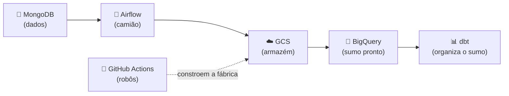

# 🎵 GUIA SUPER SIMPLES — Pôr o projeto a funcionar

Este guia explica **passo a passo, como se fosses uma criança**, como fazer este
projeto funcionar. Cada passo tem: **o que fazer**, **porquê** e **o comando**.

Não tenhas medo. É só seguir a ordem, de cima para baixo. 🙂

---

## 🧩 O que é este projeto? (a história)

Imagina uma fábrica de sumos:

1. 🍊 **As laranjas** = os dados de uma app de música (artistas, músicas, etc.).
   Ficam guardados numa "caixa" chamada **MongoDB**.
2. 🚚 **O camião** = um programa (Airflow) que vai buscar as laranjas à caixa.
3. 🏭 **A fábrica** = a Google Cloud (GCP), onde as laranjas viram sumo.
4. 🧃 **O sumo** = tabelas limpas e organizadas (BigQuery), prontas a usar.
5. 🤖 **Os robôs ajudantes** = o GitHub Actions, que faz tarefas sozinho quando
   guardas o teu código.

O objetivo é: **ligar a caixa de laranjas à fábrica e fazer sumo.** 🧃

Há **dois caminhos**:

- 🟢 **Caminho A — No teu computador (fácil, grátis, sem cartão):** ideal para
  ver tudo a funcionar e mostrar no portefólio.
- 🔵 **Caminho B — Na Google Cloud a sério (avançado):** precisa de conta GCP.

Começa pelo **Caminho A**. 👇

---

## 🟢 CAMINHO A — Correr no teu computador (recomendado para começar)

### ✅ Passo 0 — Instalar os "brinquedos" (programas)

Precisas de instalar 3 coisas (só uma vez na vida):

| Programa | Para que serve | Link |
| -------- | -------------- | ---- |
| 🐳 **Docker Desktop** | corre a "caixa" (MongoDB) e o "camião" (Airflow) | https://www.docker.com/products/docker-desktop |
| 🐍 **Python 3.10+** | a linguagem do projeto | https://www.python.org/downloads |
| 🚀 **Astro CLI** | liga o motor do Airflow | https://www.astronomer.io/docs/astro/cli/install-cli |

> Depois de instalar o **Docker Desktop**, **abre-o** e espera que fique verde
> ("Engine running"). Sem isto, nada funciona.

---

### ✅ Passo 1 — Ligar a "caixa de laranjas" (MongoDB)

**Porquê:** precisamos de dados para brincar.

Abre o terminal (PowerShell) na pasta do projeto e escreve:

```powershell
docker compose up -d
```

Isto liga o MongoDB (a caixa) e um site para o ver (mongo-express em
http://localhost:8081).

---

### ✅ Passo 2 — Encher a caixa com laranjas (dados falsos)

**Porquê:** a caixa está vazia. Vamos pô-la cheia de dados inventados.

```powershell
pip install -r seed/requirements.txt
python seed/generate_seed_data.py
```

Pronto! Agora há géneros, artistas, músicas e reproduções lá dentro. 🎶

---

### ✅ Passo 3 — Ligar o "camião" (Airflow), GRÁTIS

**Porquê:** o Airflow é quem vai buscar os dados e os organiza.

> Não precisas de conta na Astronomer! Corre tudo no teu PC.

```powershell
cd app/astro
Copy-Item .env.example .env
astro dev start
```

Espera um bocadinho. Quando acabar, abre o teu navegador em:

👉 **http://localhost:8080** (utilizador: `admin`, palavra-passe: `admin`)

Vais ver as "tarefas" (DAGs) do projeto. Carrega no botão ▶️ para as correr. 🎉

**Parabéns! Já tens o projeto a funcionar no teu computador.** 🥳

Para desligar tudo no fim:

```powershell
astro dev stop
cd ../..
docker compose down
```

---

## 🔵 CAMINHO B — Correr na Google Cloud (avançado)

Isto é como mudar a fábrica de tua casa para uma fábrica gigante de verdade.
Só faz isto se quiseres usar a **Google Cloud real**.

> ⚠️ A Google Cloud pode **cobrar dinheiro**. Tem cuidado e usa a camada
> gratuita / créditos. Para portefólio, o **Caminho A já chega**.

### 🧰 O que precisas antes de começar

| Coisa | Para que serve |
| ----- | -------------- |
| Conta Google Cloud com **faturação** ativa | é onde a fábrica vive |
| [`gcloud` CLI](https://cloud.google.com/sdk/docs/install) | falar com a Google Cloud |
| [Terraform](https://developer.hashicorp.com/terraform/downloads) | construir a fábrica com "plantas" |
| [`gh` CLI](https://cli.github.com) | falar com o GitHub |
| Um repositório no GitHub com este código | onde vivem os robôs (Actions) |

---

### 🟦 Passo B1 — Dizer "olá" à Google Cloud

```powershell
gcloud auth login
gcloud auth application-default login
```

---

### 🟦 Passo B2 — Construir a base (projeto + contas + segurança)

A "bootstrap" cria o projeto na GCP, as **service accounts** (robôs com crachá),
a ligação segura ao GitHub (WIF) e os cofres de segredos.

1. Abre o ficheiro
   [infrastructure/projects/bootstrap/env_dev.tfvars](infrastructure/projects/bootstrap/env_dev.tfvars)
   e troca todos os `REPLACE-ME-...` pelos teus valores.
2. Corre:

```powershell
cd infrastructure/projects/bootstrap
terraform init
terraform apply -var-file=env_dev.tfvars
```

Diz **yes** quando perguntar. Quando acabar, mostra uns "outputs" importantes
(guarda-os, vamos usá-los já a seguir).

> 📖 Os detalhes completos estão no [SETUP.md](SETUP.md). Este guia é o resumo
> fácil.

---

### 🔐 Passo B3 — Os SEGREDOS do GitHub (muito importante!)

**O que são:** senhas e identificadores que os robôs do GitHub Actions precisam
para entrar na Google Cloud. São **secretos**, por isso guardam-se num cofre
especial do GitHub (não no código!).

**Quais são os segredos?** (a lista completa)

| 🔑 Nome | É o quê? | De onde vem |
| ------- | -------- | ----------- |
| `WIF_PROVIDER` | o "passe de entrada" sem chave | output `wif_provider` da bootstrap |
| `DEPLOYER_SA` | o robô que constrói a infraestrutura | output `sa_deployer_email` |
| `GCP_PROJECT_DEV` | nome do projeto de testes | tu escolhes |
| `GCP_PROJECT_PRD` | nome do projeto "a sério" | tu escolhes |
| `ASTRO_API_TOKEN` | (opcional) só se usares Astronomer Cloud | da Astronomer |
| `ASTRO_DEPLOYMENT_ID_DEV` | (opcional) idem | da Astronomer |
| `ASTRO_DEPLOYMENT_ID_PRD` | (opcional) idem | da Astronomer |
| `GCP_REGION` | a região (ex: `europe-west1`) — é uma **variável**, não segredo | tu escolhes |

**Como os pôr lá?** Tens 3 maneiras (escolhe UMA):

#### Maneira 1 — Automágica (a mais fácil) 🪄

Já existe um script que faz tudo por ti:

```powershell
./scripts/set_github_secrets.ps1 `
  -Repo "o-teu-utilizador/music-stream-rawdp" `
  -ProjectDev "<id-do-projeto-dev>" `
  -ProjectPrd "<id-do-projeto-prd>" `
  -Region "europe-west1"
```

#### Maneira 2 — Escrevendo os comandos um a um

```powershell
$repo = "o-teu-utilizador/music-stream-rawdp"
"<id-do-projeto-dev>" | gh secret set GCP_PROJECT_DEV --repo $repo --body -
"<id-do-projeto-prd>" | gh secret set GCP_PROJECT_PRD --repo $repo --body -
gh variable set GCP_REGION --repo $repo --body "europe-west1"
# (WIF_PROVIDER e DEPLOYER_SA saem dos outputs da bootstrap)
```

#### Maneira 3 — Pelo site do GitHub (a clicar) 🖱️

1. Vai ao teu repositório no GitHub.
2. **Settings** (Definições) → **Secrets and variables** → **Actions**.
3. Carrega em **New repository secret** e adiciona cada um da tabela.
4. Para o `GCP_REGION`, usa o separador **Variables** em vez de Secrets.

---

### 🤖 Passo B4 — Os robôs (GitHub Actions)

**O que são:** programas que correm sozinhos no GitHub quando guardas código.
Estão na pasta `.github/workflows/`. Cada um faz uma tarefa:

| 🤖 Robô | O que faz | Quando acorda |
| ------- | --------- | ------------- |
| `ci.yml` | verifica se o código está bom (testes) | em cada push/PR |
| `terraform-plan.yml` | mostra o que vai mudar na GCP | em PR à infraestrutura |
| `terraform-apply.yml` | aplica as mudanças na GCP | push para `dev`/`main` |
| `build-dbt-image.yml` | constrói a imagem do dbt | quando mexes no dbt |
| `deploy-astro.yml` | (opcional) envia para a Astronomer | só manualmente |

**Como funcionam, simples:** quando fizeres `git push`, o robô certo acorda
sozinho, lê os **segredos** do Passo B3 para entrar na GCP **sem palavras-passe**
(magia do WIF), e faz o seu trabalho.

Para ver os robôs a trabalhar:
1. Vai ao teu repositório no GitHub.
2. Carrega no separador **Actions** (no topo).
3. Vais ver cada robô a correr (✅ verde = correu bem, ❌ vermelho = falhou).

---

### 🟦 Passo B5 — Construir a fábrica (recursos do data product)

Depois da base pronta, criamos os "tanques" e "máquinas" (BigQuery, buckets,
Cloud Run):

```powershell
cd ../resources
terraform init -backend-config="bucket=<id-do-projeto-dev>-terraform-state"
terraform apply -var-file=env_dev.tfvars
```

🎉 **Pronto! A tua fábrica está na Google Cloud.**

---

## ❓ E se alguma coisa correr mal?

| Problema | Solução simples |
| -------- | --------------- |
| 🐳 "Cannot connect to Docker" | Abre o **Docker Desktop** e espera ficar verde. |
| 🔌 Airflow não liga ao MongoDB | Confere o `.env` (deve ter `host.docker.internal`). |
| ❌ Robô do GitHub falha a vermelho | Vê se os **segredos** (Passo B3) estão todos certos. |
| 💸 Medo de gastar dinheiro | Fica pelo **Caminho A** — é grátis e local. |

---

## 🗺️ Resumo num desenho



**Caminho A** = passos verdes (no teu PC).
**Caminho B** = passos azuis (na Google Cloud).

Boa sorte! 🍀 Começa pelo Caminho A e diverte-te. 🎉
