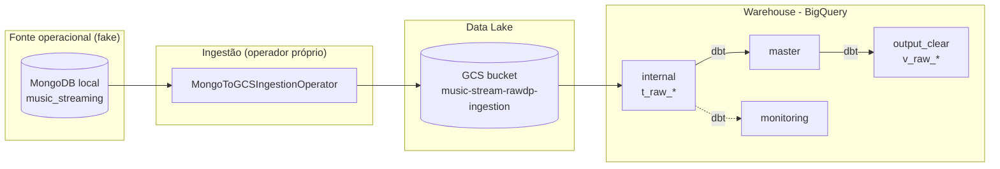

# music-stream-rawdp

> 🌐 **Idiomas:** **🇧🇷 Português (BR) (este arquivo)** · [🇬🇧 English](README_EN.md)

> **Projeto de portfólio** — pipeline de dados _end-to-end_ no estilo **Data Mesh / Data Product**,
> inspirado numa arquitetura corporativa real. Pode correr **localmente** (MongoDB fake) e é
> **provisionável em GCP real** via Terraform (projetos, IAM, Workload Identity Federation,
> Secret Manager) — ver [SETUP.md](SETUP.md).
>
> Os identificadores no repositório são placeholders (`REPLACE-ME-*`); preenche-os com os teus
> valores. Não é usado qualquer operador proprietário de ingestão/transferência de dados.

## 🎯 Objetivo

Demonstrar a construção de um **Raw Data Product** seguindo princípios de Data Mesh:

- **Ingestão** de uma fonte operacional (MongoDB) para um _data lake_ (GCS) e _warehouse_ (BigQuery),
  com um **operador de ingestão próprio** (MongoDB → GCS), sem plataformas proprietárias.
- **Orquestração** com Apache Airflow / Astronomer.
- **Transformação** com dbt seguindo arquitetura _medallion_ (`internal` → `master` → `output_clear`).
- **Infraestrutura como código** com Terraform (GCP).
- **CI/CD** com GitHub Actions.
- **Observabilidade / Data Quality** com camada de `monitoring`.

## 🧩 Domínio (fictício)

Uma plataforma de _streaming_ de música. A fonte operacional (MongoDB) expõe quatro coleções:

| Coleção (MongoDB) | Entidade | Descrição |
| ----------------- | -------- | --------- |
| `Genre_ViewDP`    | genre    | Géneros musicais |
| `Artist_ViewDP`   | artist   | Artistas / bandas |
| `Track_ViewDP`    | track    | Faixas / músicas |
| `Stream_ViewDP`   | stream   | Eventos de reprodução (plays) |

> Mapeamento conceptual face ao projeto original (TV EPG): `category→genre`,
> `channel→artist`, `program→track`, `event→stream`.

## 🏗️ Arquitetura



## 📂 Estrutura do repositório

```text
.
├── app/                      # Aplicações: DAGs (Airflow) e configs de ingestão
│   ├── astro/                # Projeto Astro: dags/, music_stream_rawdp/base.py, include/
│   └── ingestion/            # connections/ e sources/ (JSON declarativos, formato próprio)
├── seed/                     # Gerador de dados fake + carga no MongoDB local
├── transformations/dbt/      # Projeto dbt (medallion)
├── infrastructure/           # Terraform (módulos + projeto resources)
├── tests/                    # Testes (pytest)
├── .github/workflows/        # CI/CD
└── docker-compose.yml        # MongoDB + mongo-express locais
```

## 🚀 Como correr localmente

Pré-requisitos: **Docker**, **Python 3.10+**.

```powershell
# 1. Subir o MongoDB fake
docker compose up -d

# 2. Instalar dependências do gerador de dados
python -m venv .venv ; .\.venv\Scripts\Activate.ps1
pip install -r seed/requirements.txt

# 3. Gerar e carregar dados fake no MongoDB
python seed/generate_seed_data.py

# 4. (Opcional) Explorar os dados em http://localhost:8081 (mongo-express)
```

Para o resto do pipeline (Airflow, dbt, Terraform) ver os `README.md` de cada pasta.
Para provisionar em **GCP real** (projetos, service accounts, WIF, Secret Manager),
segue o [SETUP.md](SETUP.md).

## 🛠️ Stack

Python · MongoDB · Apache Airflow / Astronomer · dbt · BigQuery · Google Cloud Storage ·
Cloud Run · Terraform · GitHub Actions · Docker.

## ⚠️ Aviso

Projeto pessoal de portfólio. Os IDs de projeto GCP, _service accounts_, _endpoints_ de rede,
credenciais e nomes de organização vêm como placeholders (`REPLACE-ME-*`) — o repositório **não**
aponta para nenhum sistema real até os preencheres. Ao seguir o [SETUP.md](SETUP.md) crias os teus
próprios recursos GCP. A ingestão é feita por um operador próprio (MongoDB → GCS); **não** são
usadas plataformas proprietárias de ingestão ou transferência de dados.
