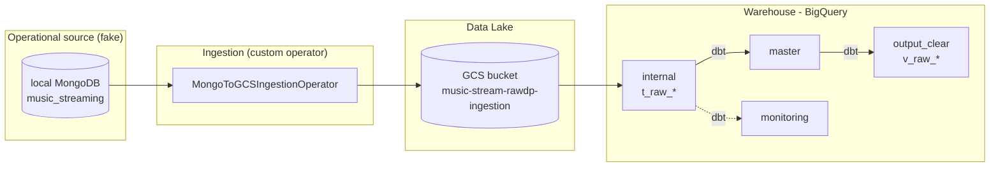

# music-stream-rawdp

> 🌐 **Languages:** [🇧🇷 Português (BR)](README.md) · **🇬🇧 English (this file)**

> **Portfolio project** — an _end-to-end_ data pipeline in the **Data Mesh / Data Product**
> style, inspired by a real corporate architecture. It can run **locally** (fake MongoDB) and is
> **provisionable on real GCP** via Terraform (projects, IAM, Workload Identity Federation,
> Secret Manager) — see [SETUP.md](SETUP.md).
>
> The identifiers in the repository are placeholders (`REPLACE-ME-*`); fill them in with your own
> values. No proprietary ingestion/data-transfer operator is used.

## 🎯 Goal

Demonstrate building a **Raw Data Product** following Data Mesh principles:

- **Ingestion** from an operational source (MongoDB) into a _data lake_ (GCS) and _warehouse_
  (BigQuery), with a **custom ingestion operator** (MongoDB → GCS), no proprietary platforms.
- **Orchestration** with Apache Airflow / Astronomer.
- **Transformation** with dbt following a _medallion_ architecture (`internal` → `master` → `output_clear`).
- **Infrastructure as code** with Terraform (GCP).
- **CI/CD** with GitHub Actions.
- **Observability / Data Quality** with a `monitoring` layer.

## 🧩 Domain (fictional)

A music _streaming_ platform. The operational source (MongoDB) exposes four collections:

| Collection (MongoDB) | Entity | Description |
| -------------------- | ------ | ----------- |
| `Genre_ViewDP`       | genre  | Music genres |
| `Artist_ViewDP`      | artist | Artists / bands |
| `Track_ViewDP`       | track  | Tracks / songs |
| `Stream_ViewDP`      | stream | Playback events (plays) |

> Conceptual mapping to the original project (TV EPG): `category→genre`,
> `channel→artist`, `program→track`, `event→stream`.

## 🏗️ Architecture



## 📂 Repository structure

```text
.
├── app/                      # Applications: DAGs (Airflow) and ingestion configs
│   ├── astro/                # Astro project: dags/, music_stream_rawdp/base.py, include/
│   └── ingestion/            # connections/ and sources/ (declarative JSON, custom format)
├── seed/                     # Fake data generator + load into local MongoDB
├── transformations/dbt/      # dbt project (medallion)
├── infrastructure/           # Terraform (modules + resources project)
├── tests/                    # Tests (pytest)
├── .github/workflows/        # CI/CD
└── docker-compose.yml        # local MongoDB + mongo-express
```

## 🚀 How to run locally

Prerequisites: **Docker**, **Python 3.10+**.

```powershell
# 1. Start the fake MongoDB
docker compose up -d

# 2. Install the data generator dependencies
python -m venv .venv ; .\.venv\Scripts\Activate.ps1
pip install -r seed/requirements.txt

# 3. Generate and load fake data into MongoDB
python seed/generate_seed_data.py

# 4. (Optional) Explore the data at http://localhost:8081 (mongo-express)
```

For the rest of the pipeline (Airflow, dbt, Terraform) see the `README.md` of each folder.
To provision on **real GCP** (projects, service accounts, WIF, Secret Manager),
follow [SETUP.md](SETUP.md). For a guided step-by-step, see [START_HERE.md](START_HERE.md).

## 🛠️ Stack

Python · MongoDB · Apache Airflow / Astronomer · dbt · BigQuery · Google Cloud Storage ·
Cloud Run · Terraform · GitHub Actions · Docker.

## ⚠️ Disclaimer

Personal portfolio project. The GCP project IDs, _service accounts_, network _endpoints_,
credentials and organization names come as placeholders (`REPLACE-ME-*`) — the repository does
**not** point to any real system until you fill them in. By following [SETUP.md](SETUP.md) you
create your own GCP resources. Ingestion is done by a custom operator (MongoDB → GCS); **no**
proprietary ingestion or data-transfer platforms are used.
