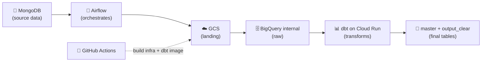
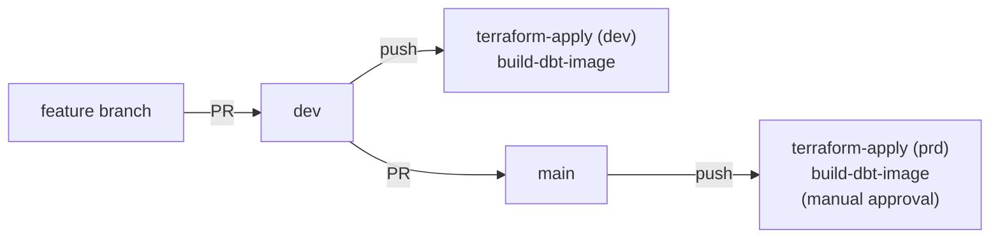

# 🎵 START HERE — Complete guide to replicate the project

> 🌐 **Languages:** [🇧🇷 Português (BR)](COMECAR_AQUI.md) · **🇬🇧 English (this file)**

This guide takes **anyone** from zero to a working pipeline. Follow the steps in
order, top to bottom. Each step states **what to do**, **why**, and the
**exact command**.

There are two paths. Do **A** first (it's free and proves everything works); do
**B** only when you want to run on real Google Cloud.

| Path | Where it runs | Cost | For |
| ---- | ------------- | ---- | --- |
| 🟢 **A — Local** | your PC (Docker) | free | learning, demo, portfolio |
| 🔵 **B — Real GCP** | Google Cloud | may charge | real dev/prd environment |

---

## 🧩 What the project does (in 30 seconds)

A **data product** that pulls data from a music app in **MongoDB**, moves it to
**Google Cloud**, and turns it into clean tables in **BigQuery** with **dbt**,
orchestrated by **Airflow** and automated by **GitHub Actions**.



**BigQuery layers:** `internal` (raw) → `master` (`t_raw_*`, curated) →
`output_clear` (`v_raw_*`, consumption views) → `monitoring` (freshness).

---

## 🗂️ Repository structure (map)

```
FINAL_PROJECT/
├─ docker-compose.yml          # MongoDB + mongo-express (local)
├─ seed/                       # generates fake data in MongoDB
├─ app/astro/                  # Airflow project (Astro CLI)
│  ├─ dags/                    # the ETL DAG
│  ├─ music_stream_rawdp/      # config (base.py) and operators
│  └─ .env.example             # local environment variables
├─ transformations/dbt/        # dbt models (master, output_clear, ...)
├─ infrastructure/             # Terraform (bootstrap + resources)
│  └─ projects/
│     ├─ bootstrap/            # GCP project + SAs + WIF + state bucket
│     └─ resources/            # buckets, datasets, Cloud Run, ...
├─ .github/workflows/          # CI/CD (ci, terraform, build-dbt-image, ...)
├─ scripts/                    # set_github_secrets.ps1 / .sh
├─ tests/                      # pytest
├─ SETUP.md                    # detailed technical version of Path B
└─ COMECAR_AQUI.md             # Portuguese (BR) version of this guide
```

---

# 🟢 PATH A — Run on your computer

### Step 0 — Install the tools (once)

| Tool | For | Link |
| ---- | --- | ---- |
| 🐳 **Docker Desktop** | runs MongoDB and Airflow | https://www.docker.com/products/docker-desktop |
| 🐍 **Python 3.10+** | project language | https://www.python.org/downloads |
| 🚀 **Astro CLI** | local Airflow engine | https://www.astronomer.io/docs/astro/cli/install-cli |

> Open **Docker Desktop** and wait for it to turn green ("Engine running").
> Nothing works without it.

**Verify everything is installed:**

```powershell
docker --version
python --version
astro version
```

---

### Step 1 — Clone the project

```powershell
git clone https://github.com/<your-username>/music-stream-rawdp.git
cd music-stream-rawdp
```

---

### Step 2 — Start MongoDB (source data)

```powershell
docker compose up -d
```

Starts MongoDB and **mongo-express** (visual UI) at http://localhost:8081.

**Verify:** `docker compose ps` should show the containers `Up`.

---

### Step 3 — Fill MongoDB with fake data

```powershell
pip install -r seed/requirements.txt
python seed/generate_seed_data.py
```

Creates genres, artists, tracks and streams. Confirm in mongo-express
(http://localhost:8081) that collections exist in the `music_streaming` database.

---

### Step 4 — Configure the Airflow environment

```powershell
cd app/astro
Copy-Item .env.example .env
```

Open `.env` and confirm (for local Path A, the defaults are fine):

- `DEPLOY_ENV=dev`
- `MONGO_URI=...host.docker.internal...` (Airflow in Docker reaches the Mongo on
  your PC via `host.docker.internal`).

> ℹ️ Path A doesn't need GCP. If you want the steps that write to GCS/BigQuery to
> work, follow Path B first and use the GCP credentials (see Step B7).

---

### Step 5 — Start Airflow

```powershell
astro dev start
```

When it finishes, open 👉 **http://localhost:8080** (user `admin`, password
`admin`).

Enable the `music-stream-rawdp-etl` DAG and click ▶️ to trigger it.

**Useful commands:**

```powershell
astro dev restart   # applies .env / config changes (re-read on startup)
astro dev stop      # stops Airflow
astro dev logs      # view logs
```

---

### Step 6 — Shut everything down

```powershell
astro dev stop
cd ../..
docker compose down
```

✅ **Path A complete.**

---

# 🔵 PATH B — Run on Google Cloud (dev and prd)

> ⚠️ GCP may **charge**. Use credits / free tier. For a portfolio, Path A is
> enough. The detailed technical version is in [SETUP.md](SETUP.md).

### What you need first

| Tool | For | Link |
| ---- | --- | ---- |
| GCP account with **billing** enabled | where the infra lives | — |
| [`gcloud` CLI](https://cloud.google.com/sdk/docs/install) | talk to GCP | — |
| [Terraform >= 1.6](https://developer.hashicorp.com/terraform/downloads) | provision infra | — |
| [`gh` CLI](https://cli.github.com) | configure GitHub secrets | — |
| GitHub repository with this code | where Actions run | — |

Collect these values before starting:

| Value | How to get it |
| ----- | ------------- |
| `billing_account` | `gcloud billing accounts list` |
| `org_id` or `folder_id` | `gcloud organizations list` |
| `github_repository` | `owner/music-stream-rawdp` |
| `project_id` dev/prd | choose globally unique IDs |

---

### Step B1 — Authenticate to GCP

```powershell
gcloud auth login
gcloud auth application-default login
```

---

### Step B2 — Bootstrap (project + SAs + WIF + state bucket + secrets)

The `bootstrap` stack uses a **local** backend and creates the base everything
else relies on. Run it **once per environment** (dev and prd).

1. Edit `infrastructure/projects/bootstrap/env_dev.tfvars` (and `env_prd.tfvars`)
   and replace all `REPLACE-ME-*`.
2. Apply:

```powershell
cd infrastructure/projects/bootstrap
terraform init
terraform apply -var-file=env_dev.tfvars
terraform apply -var-file=env_prd.tfvars
```

3. Save the outputs (you need them in Step B4):

```powershell
terraform output
# wif_provider      -> projects/.../providers/github-provider
# sa_deployer_email -> sa-terraform-deployer@<project>.iam.gserviceaccount.com
# tf_state_bucket   -> <project>-terraform-state
```

---

### Step B3 — MongoDB credentials in Secret Manager

Bootstrap creates the `MONGO_USER` and `MONGO_PW` secrets **empty**. Fill them in
(Terraform never touches the values):

```powershell
echo -n "your-username" | gcloud secrets versions add MONGO_USER --data-file=- --project <project_id>
echo -n "your-password"  | gcloud secrets versions add MONGO_PW   --data-file=- --project <project_id>
```

---

### Step B4 — GitHub secrets (for CI/CD)

The workflows enter GCP **keylessly** (Workload Identity Federation), but they
need the identifiers. Full list:

| Name | Type | Value | Used by |
| ---- | ---- | ----- | ------- |
| `WIF_PROVIDER` | secret | output `wif_provider` | terraform-plan/apply, build-dbt-image |
| `DEPLOYER_SA` | secret | output `sa_deployer_email` | terraform-plan/apply, build-dbt-image |
| `GCP_PROJECT_DEV` | secret | dev project id | terraform, build-dbt-image |
| `GCP_PROJECT_PRD` | secret | prd project id | terraform, build-dbt-image |
| `GCP_REGION` | **variable** | e.g. `europe-west1` | build-dbt-image |
| `ASTRO_API_TOKEN` | secret (optional) | Astronomer token | deploy-astro |
| `ASTRO_DEPLOYMENT_ID_DEV` | secret (optional) | dev deployment id | deploy-astro |
| `ASTRO_DEPLOYMENT_ID_PRD` | secret (optional) | prd deployment id | deploy-astro |

**Easy way — automatic script** (reads `WIF_PROVIDER`/`DEPLOYER_SA` from the
bootstrap outputs):

```powershell
./scripts/set_github_secrets.ps1 `
  -Repo "owner/music-stream-rawdp" `
  -ProjectDev "<project_id_dev>" `
  -ProjectPrd "<project_id_prd>" `
  -Region "europe-west1"
```

**Manual way** (`gh` CLI) or **via web** (Settings → Secrets and variables →
Actions): see details in [SETUP.md](SETUP.md).

> 🔒 For `terraform-apply` in **prd** to run, also create the **`prd` Environment**
> on GitHub (Settings → Environments) with a required reviewer — that way the
> production deploy waits for your approval.

---

### Step B5 — Provision resources (buckets, datasets, Cloud Run)

Fill `infrastructure/projects/resources/env_dev.tfvars` with `project_id`,
`project_number` (bootstrap output) and the SA emails.

```powershell
cd ../resources
terraform init -backend-config="bucket=<project_id_dev>-terraform-state"
terraform apply -var-file=env_dev.tfvars
```

Creates: `internal`/`master`/`output_clear`/`monitoring` datasets, raw tables,
GCS buckets and the dbt Cloud Run Job (+ Artifact Registry).

> In CI this is automatic: PR to infrastructure → `terraform-plan`; merge to
> `dev`/`main` → `terraform-apply`.

---

### Step B6 — Build and publish the dbt image

dbt runs in a **Cloud Run Job** from an **image** in Artifact Registry. Cloud Run
uses the published image, **not** your local code — so any change to the dbt
models only reaches GCP after you republish.

```powershell
cd ../../../transformations/dbt/music_stream_rawdp
gcloud auth configure-docker europe-west1-docker.pkg.dev
docker build -t europe-west1-docker.pkg.dev/<project_id>/ar-music-stream-rawdp-d/dbt:latest .
docker push europe-west1-docker.pkg.dev/<project_id>/ar-music-stream-rawdp-d/dbt:latest
```

> In CI: the `build-dbt-image` workflow does this automatically on push touching
> `transformations/dbt/**`.

---

### Step B7 — Point Airflow at GCP

In `app/astro/.env`, choose the environment. **Keep a single active definition
per key** (comment out the other) so you don't target the wrong project:

```properties
# DEPLOY_ENV=dev
DEPLOY_ENV=prd
# GOOGLE_CLOUD_PROJECT=<project_id_dev>
GOOGLE_CLOUD_PROJECT=<project_id_prd>
# AIRFLOW_CONN_GOOGLE_CLOUD_DEFAULT={"conn_type":"google_cloud_platform","extra":{"project":"<project_id_dev>"}}
AIRFLOW_CONN_GOOGLE_CLOUD_DEFAULT={"conn_type":"google_cloud_platform","extra":{"project":"<project_id_prd>"}}
```

Then `astro dev restart` (the `.env` is only read on startup).

**Local → GCP auth:** Airflow uses your Application Default Credentials (mounted
via `docker-compose.override.yml`) and **impersonates** the `sa-astronomer@<project>`
service account. For that, your user needs `roles/iam.serviceAccountTokenCreator`
on that SA:

```powershell
gcloud iam service-accounts add-iam-policy-binding `
  "sa-astronomer@<project_id>.iam.gserviceaccount.com" `
  --project <project_id> `
  --member="user:<your-email>" `
  --role="roles/iam.serviceAccountTokenCreator"
```

> IAM propagation can take ~1 minute. Verify with:
> `gcloud auth print-access-token --impersonate-service-account=sa-astronomer@<project_id>.iam.gserviceaccount.com`

Trigger the DAG in the Airflow UI. Confirm results in BigQuery (`master` and
`output_clear` datasets of your project).

---

## 🔁 Switch between dev and prd

1. In `app/astro/.env`, comment/uncomment the 3 keys: `DEPLOY_ENV`,
   `GOOGLE_CLOUD_PROJECT`, `AIRFLOW_CONN_GOOGLE_CLOUD_DEFAULT`.
2. `astro dev restart`.

Everything else (`PROJECT`, ingestion bucket, Cloud Run job, dbt `--target`) is
derived automatically from `DEPLOY_ENV` in `app/astro/music_stream_rawdp/base.py`.

---

## 🌳 Git / CI flow (how code reaches dev and prd)



| Workflow | When it runs | What it does |
| -------- | ------------ | ------------ |
| `ci.yml` | every push/PR | flake8 + pytest + `dbt parse` |
| `terraform-plan.yml` | PR to `infrastructure/**` | plan (dev on PR→dev, prd on PR→main) |
| `terraform-apply.yml` | push `dev`/`main` | applies infra (prd needs approval) |
| `build-dbt-image.yml` | push to `transformations/dbt/**` | rebuilds dbt image |
| `deploy-astro.yml` | manual | deploy to Astronomer Cloud (optional) |

> Required checks to merge into `main` are: **Python lint & tests**, **dbt parse**,
> **Terraform fmt & validate**. The `Plan (prd)` check may appear red on a PR from
> a non-protected branch (the prd Environment rejects the job) — this does **not**
> block the merge.

---

## ✅ Local tests (before pushing)

```powershell
pip install flake8 pytest
flake8 app seed tests --max-line-length=120 --extend-ignore=E203,W503
pytest -q
```

dbt (optional, inside `transformations/dbt/music_stream_rawdp`):

```powershell
dbt deps
dbt parse --no-partial-parse
```

---

## ❓ Troubleshooting

| Problem | Cause / Fix |
| ------- | ----------- |
| 🐳 "Cannot connect to Docker" | Open Docker Desktop and wait for it to turn green. |
| 🔌 Airflow can't reach MongoDB | In `.env`, `MONGO_URI` must use `host.docker.internal`. |
| 🪣 `404 bucket does not exist` | The bucket is `<project_id>-ingestion`. Check `DEPLOY_ENV` and that infra was applied. |
| 🔑 `PERMISSION_DENIED ... getAccessToken` | Missing `serviceAccountTokenCreator` on `sa-astronomer` (Step B7) or still propagating (~1 min). |
| 🧱 dbt "Nothing to do" | `--select` points at a non-existent model; check the model names. |
| ❌ Action is red | Check the Step B4 secrets and that bootstrap was applied. |
| 🔁 Changed `.env` but nothing changes | Run `astro dev restart` (the `.env` is only read on startup). |
| 🧪 dbt on GCP uses old models | Republish the dbt image (Step B6) — Cloud Run uses the image, not local code. |
| 💸 Afraid of costs | Stay on Path A (local and free). |

---

## 🧹 Cleanup (destroy GCP infra)

```powershell
cd infrastructure/projects/resources
terraform destroy -var-file=env_dev.tfvars

cd ../bootstrap
terraform destroy -var-file=env_dev.tfvars
```

---

Good luck! 🍀 Start with **Path A**, confirm everything runs, and only then move
on to **Path B**.
